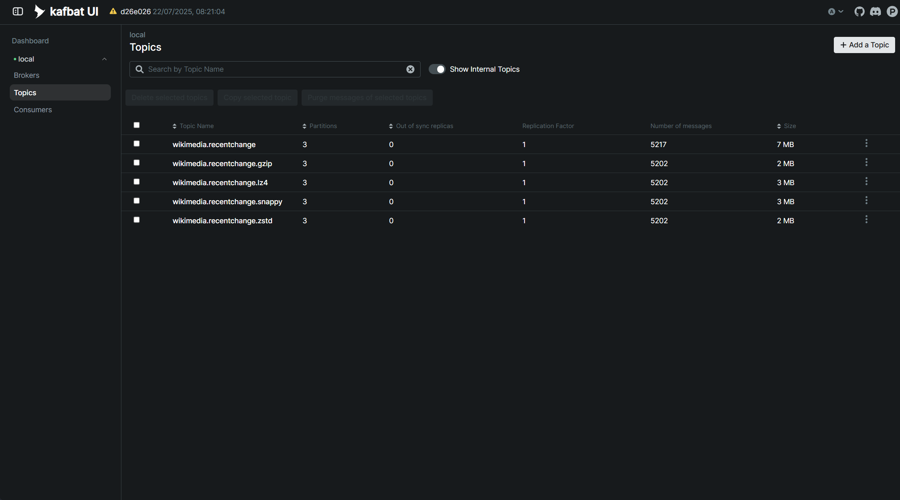

# Kafka Wikimedia Compression Benchmark

This project explores different compression algorithms in Kafka using real-time events from Wikimedia. It sets up a Kafka producer and consumer to process Wikimedia events, using various compression strategies like `gzip`, `lz4`, `snappy`, and `zstd`. The received events are then sent to OpenSearch for indexing and analysis.

## Setup

This project requires five Kafka topics, each configured with a different compression strategy. You can create them
using the following CLI commands:

> ⚠️ Make sure your Kafka broker is running on localhost:9094. Adjust the --bootstrap-server parameter if needed.

```bash
for topic in \
  'wikimedia.recentchange' \
  'wikimedia.recentchange.gzip' \
  'wikimedia.recentchange.lz4' \
  'wikimedia.recentchange.snappy' \
  'wikimedia.recentchange.zstd'; \
  do
    kafka-topics \
    --bootstrap-server localhost:9094 \
    --create \
    --topic $topic \
    --replication-factor 1 \
    --partitions 3;
done
```

## Project Structure

This project is divided into two main components:

- **Producer**: This component generates and sends events to the Kafka topics.
- **Consumer**: This component reads events from the Kafka topics and sends them to OpenSearch.

## Producer API

As Wikimedia events are produced in a fast-paced manner, the producer API allows you to control how much time the producer
should listen for events before stopping. The API is designed to be straightforward and straightforward, allowing you to start the producer with a specified duration.

| Endpoint         | Method | Description                    | Payload Example    |
|------------------|--------|--------------------------------|--------------------|
| `/api/v1/events` | POST   | Starts listener of pre-defined | `{ "millis": 10 }` |

## Results

As shown in the figure below, `gzip` and `zstd` achieved better compression rates for the Wikimedia events. This
comparison focuses solely on compression ratio. Although it does not account for CPU usage or latency overhead
introduced by each algorithm, this benchmark provides a useful perspective on how compression algorithms behave under
real-world streaming scenarios.

